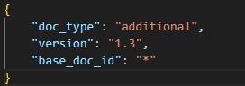

# RAG-based Specification Management System

# Quick Start

## Installation
1. Configure python environment (ex. `conda create -n llm_prj_env python=3.11`, `conda activate llm_prj_env`)
2. Install requirements
    - `pip install -r requirements.txt`
3. Create pinecone index
    - from console: [pinecone-console](https://app.pinecone.io/)
    - from code: [documentation](https://docs.pinecone.io/guides/indexes/create-an-index)
4. Set secret environments
    - set API Keys to `.streamlit/secrets.toml` (already registered in `.gitignore`)
    - `OPENAI_API_KEY`, `PINECONE_API_KEY`, `PINECONE_INDEX_NAME`, `UPSTAGE_API_KEY`, ...
    - set AWS envs if you want to use S3
    - see `.streamlit/secrets_sample.toml`

## Configuration Guide
```json
{
    "global": {
        "lang": {
            "user": "Korean",
            "source": "English",
            "assistant": "Korean"
        },
        "context_hierarchy": true
    },
    "chat": {

    },
    "rag": {
        "ingestion": {
            "ingestor": "pinecone-multivector", // one of IngestorManager.ingestors
            "embeddings": "text-embedding-3-small",
            "namespace": "parent", // pinecone index namespace
            "sub_namespace": "child" // pinecone index namespace
        },
        "transformation": {
            "model": "gpt-4o-mini",
            "enable": {
                "translation": true,
                "rewriting": true,
                "expansion": false,
                "hyde": true
            }
        },
        "retrieval": {
            "retriever": ["pinecone-multivector"], // sub list of RetrieverManager.retrievers
            "namespace": "parent", // pinecone index namespace
            "sub_namespace": "child", // pinecone index namespace
            "embeddings": "text-embedding-3-small",
            "top_k": 6
        },
        "generation": {
            "model": "gpt-4o"
        },
        "fact_verification": {
            "model": "gpt-4o",
            "enable": false
        }
    }
}
```

## Ingestions
### General Ingestion Guide
1. Configure your own `BaseRAGLoader`
2. Run `ingest.py` with your loader

> Run `python ingest.py -h` for further information

### Upstage Ingestion Guide
`python ingest.py -l upstage_layout -s [source_dir] -b [backup_dir] -a`

1. Set `UPSTAGE_API_KEY`
2. Prepare source documents
    - Default source directory: `./source_documents/*`
    - You can set your own directory by running `ingest.py` with `-s [source_dir]` option
    - To attach metadata, place `[file_name].metadata.json` in the same location as the original document.
    - Example documents:
        - 
    - Metadata
        - 
    - **Note:** if you want to download from S3, use `-d` option. But, it will take a lot of time.
3. Set backup directory
    - Analyzing layout is expensive task. You can cache the result by specifying `backup_dir` with `-b [backup_dir]` option
4. If you want to ingest the entire documents, add `-a` option. If not set, ingestor will scan `ingestor_logs.txt` and ingest only missing files. Default backup directory is set to `./backup/*`
5. Run `python ingest.py` with `-l upstage_layout` option.

> If you want to ingest from backup directory, use `-l upstage_backup` loader with proper `-b [backup_dir]` <br>
> `python ingest.py -l upstage_backup -b [backup_dir] -a`


## Run App

- Run `streamlit run chat.py`
- If you want to deploy the streamlit app, see [link](https://docs.streamlit.io/deploy/streamlit-community-cloud/deploy-your-app)

# Project Structure

# 주의 사항
- Default PyPDFLoader를 사용하게 되면 (loader name: `pypdf`), doc_id에 local path가 그대로 들어가게 됨 (ex. `/home/fadu/prj/source_documents/major.pdf`)