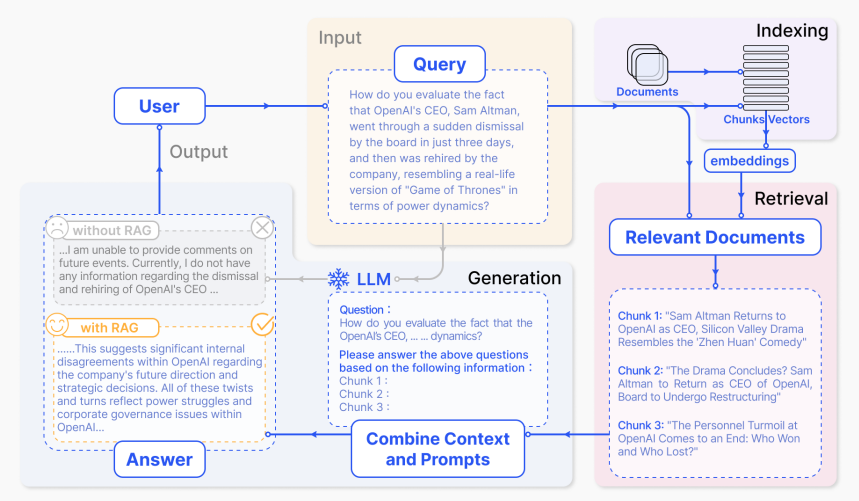

# LLM Project Review - RAG-based Specification Management System

# Introduction

## Motivation

고객의 요청 사항을 엄격하게 준수해야하는 산업에서는, 사내 직원들이 최신 문서의 변경 사항을 빠르게 파악하는 것이 매우 중요하다. 숙지 대상이 되는 문서들로는 기술에 대한 매뉴얼, 클라이언트 별 요청 사항 등이 있을 수 있다. 이러한 문서들에 대한 변경 사항은 클라이언트와의 상호작용 및 프로젝트 결과에 중요한 영향을 미칠 수 있다. 

하지만 방대한 양의 문서를 모두 숙지하는 것은 매우 어려운 작업이다. 특정 명령어가 필수적인지 (Optimal/Mandatory), 또는 performance requirements에서 특정 워크로드를 어느 수준까지 지원해야하는지 등 수많은 상세 사항을 일일이 기억하는 것은 쉽지 않다.

이러한 변경 사항을 수동으로 추적하는 것은 시간이 많이 소요되고, 작업자에 의한 오류(human error)를 낳을 가능성이 높다. 특히, 개인이 정리한 변경 사항을 전사에서 공유한다면, 작은 실수가 클라이언트와의 의사소통 과정에서 문제를 초래할 수 있다. 따라서, 문서의 변경 사항을 효율적으로 관리하고, 직원들이 항상 정확한 최신 정보를 이용할 수 있도록 지원하는 사내 인프라의 필요성을 인식하였다.

## Background: LLM & RAG

사내의 집단 지식을 수집, 정리, 적용하려는 노력은 수십 년간 지속되어 왔으며, 아직까지도 정형화된 방식은 존재하지 않는다. 기업의 지식 베이스를 구성하는 데이터는 대부분 비정형성을 지니고 있으며, 지금까지의 소프트웨어 도구들은 이러한 비정형 데이터가 가지고 있는 노이즈를 효과적으로 다루지 못했다.

하지만 최근 많은 사용자들이 이용하는 대형 언어 모델(LLM)은 이러한 비정형 데이터를 처리하고 이해하는데에 강점을 보인다. LLM은 Pdf, excel, image 등 반정형(semi-structured) 데이터에 대해서도 대처하는 능력을 가지고 있고, 사용자의 요청에 따라 출력 형식을 유연하게 조절할 수 있어 입출력의 형식에서 자유도가 높은 소프트웨어 도구이다.

하지만 LLM의 경우, 이른바 '환각(hallucination) 문제'라고 불리는 현상이 발생할 수 있다. 이는 언어 모델이 자신이 알고 있는 정보 이상의 것을 생성하거나, 없는 정보를 만들어내는 현상으로[1](...), 정확성과 신뢰성이 요구되는 환경에서는 환각의 존재는 치명적일 수 있다. 또한, LLM은 학습 과정에서 얻은 자료만 인지하고 있기 때문에, 전문성을 요하는 구체적인 자료에 대한 질의응답은 환각 문제를 쉽게 야기한다. 이러한 문제를 해결하기 위해, LLM과 고전적인 정보 검색 시스템을 결합한 RAG(Retrieval-Augmented Generation) 방식이 제안되었다.

RAG는 LLM의 생성 능력과 고전 정보 검색 시스템의 신뢰성을 결합함으로써, LLM이 정확한 정보를 바탕으로 답변을 생성할 수 있도록 유도한다[2](...). 이를 통해 기업 내에서 생성된 다양한 정형/비정형 데이터와 문서에서 사용자의 질문을 답변하기 위해 필요한 정보를 검색하고, 이를 바탕으로 신뢰성있는 답변을 제공한다.

Figure 1은 RAG 파이프라인의 전형적인 예시이다. RAG는 Indexing phase, Retrieval phase, 그리고 Generation phase의 세 단계로 나뉜다. Indexing 단계에서는 가지고 있는 데이터베이스나 문서를 미리 chunk 단위로 조각낸 후, vector 형태로 임베딩하여 벡터 데이터베이스에 저장한다. 그리고 사용자가 질문을 하면, retrieval 단계에서 query와 가장 유사도가 높은 몇 개의 chunk를 벡터 데이터베이스에서 찾아낸다. 그리고 마지막으로 generation 단계에서 사용자의 질문과 함께, 찾아낸 문서 조각들을 LLM에 함께 제공하여 답변을 생성한다. 

이러한 파이프라인을 통해, 수 많은 문서 중 질문에 대한 답을 포함하고 있을 것으로 추정되는 문서 조각들을 LLM에게 배경지식으로 제공함으로써, 환각 문제를 최소화하고 LLM이 출력하는 답변의 신뢰성을 높인다.

## Objective

본 프로젝트의 목표는 다음과 같다.
- **정확성**: 다량의 지식 베이스를 기반으로 올바른 정보를 직원들에게 제공하여, 클라이언트의 구체적인 요구 사항을 정확하게 처리할 수 있도록 지원한다.
- **최신화**: 문서 내에서 발생한 변경 사항을 정확하게 추적하고, 최신 문서 버전을 지속적으로 모니터링하여, 잦은 문서 변화에도 직원들이 항상 최신 정보에 쉽게 접근할 수 있도록 돕는다.
- **자동화**: 문서 변경 사항의 추적과 관리를 자동화하여, 직원들의 수작업 부담을 줄이고, 작업 효율성을 높인다.
- **비정형 데이터의 효과적 관리**: 다양한 형식(pdf, excel 등)의 정형/반정형 데이터를 유연하게 처리하여 검색하기 쉬운 형태로 유지한다.

# Methods

## System Architecture

RAG는 간단한 파이프라인을 가지고 있지만, 